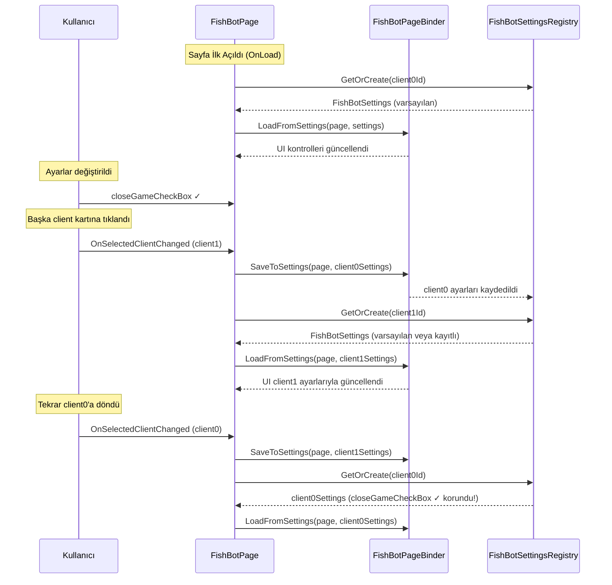

# 📘 FishBot Per-Client Ayar Sistemi — Mimari Rehberi

Bu doküman, `FishBotPage` üzerindeki tüm kontrol değerlerinin her bir client için ayrı ayrı saklandığı ve client kartları arasında gezinirken verilerin kaybolmadığı sistemin mimarisini açıklar.

---

## 🗂️ Yeni Dosya Haritası

```
Aether/
│
├── 📂 Assets/
│   └── 📄 fishbot_settings_example.json     → Tüm FishBotPage alanlarının örnek JSON yapısı
│
├── 📂 Models/
│   ├── 📄 FishBotSettings.cs                → Per-client ayar modeli (JSON yapısını yansıtır)
│   └── 📄 FishFilterItemState.cs            → Balık filtresi tek öğe state modeli
│
├── 📂 States/
│   └── 📄 FishBotSettingsRegistry.cs        → Client ID → FishBotSettings haritasını tutan singleton
│
├── 📂 Helpers/
│   ├── 📄 FishBotPageBinder.cs              → UI ↔ Settings çift yönlü bağlama
│   └── 📄 FishFilterTableBuilder.cs         → (Güncellendi) Checkbox'lara Tag ataması eklendi
│
└── 📂 Pages/
    └── 📄 FishBotPage.cs                    → (Güncellendi) Save/Load akışı entegre edildi
```

---

## 🧱 Katman Sorumluluklari

### `Models/FishBotSettings.cs`
FishBotPage üzerindeki **tüm kontrol değerlerinin** per-client kalıcı veri transfer nesnesi (DTO).  
`fishbot_settings_example.json` yapısını doğrudan yansıtır.

**İçerdiği alanlar:**

| Alan | Tip | Varsayılan | Açıklama |
|------|-----|------------|----------|
| `CloseGameEnabled` | bool | false | Oyundan çık aktif mi |
| `CloseGameAfterMinutes` | int | 25 | Kaç dakika sonra |
| `ChangeChannelEnabled` | bool | false | Kanal değiştirme aktif mi |
| `ChangeChannelAfterMinutes` | int | 25 | Kanal değiştirme süresi |
| `SelectAllChannels` | bool | true | Tüm kanallar seçili mi |
| `Ch1`...`Ch6` | bool | true | Kanal seçim durumları |
| `CharacterScreenEnabled` | bool | false | Karakter atma aktif mi |
| `CharacterScreenAfterMinutes` | int | 25 | Kaç dakika sonra |
| `BuyCampfireEnabled` | bool | false | Kamp ateşi satın al aktif mi |
| `CampfireCount` | int | 5 | Kamp ateşi adedi |
| `BuyWormEnabled` | bool | false | Solucan satın al aktif mi |
| `WormCount` | int | 5 | Solucan adedi |
| `AnimationMode` | string | "mount" | "mount" veya "armor" |
| `InventoryPage` | int | 1 | Envanter sayfası numarası |
| `FishingSpeedMinMs` | int | 150 | Oltalama min hızı (ms) |
| `FishingSpeedMaxMs` | int | 250 | Oltalama max hızı (ms) |
| `FishFilter` | `Dictionary<string, Dictionary<string, FishFilterItemState>>` | {} | Balık filtresi state'leri |

**Yardımcı metot:**
```csharp
public FishFilterItemState GetOrCreateFilterItem(string categoryId, string itemKey)
```
Belirtilen kategori ve öğe için mevcut state nesnesini döner ya da oluşturur.

---

### `Models/FishFilterItemState.cs`
Balık filtresi tablolarındaki **tek bir öğeye ait** eylem seçimlerini tutar.

```
"Balığı Tut" → true
"Pişir"      → false
"Öldür"      → false
"Yere At"    → false
```

Sütun ismi (columnKey), `fish_filter_config.json`'daki `headerText` değeriyle **tam eşleşir**.

---

### `States/FishBotSettingsRegistry.cs`
Her client için ayrı bir `FishBotSettings` nesnesi tutan **Singleton kayıt defteri**.

```csharp
FishBotSettingsRegistry.Instance.GetOrCreate(clientId);
```

- Client için ilk kez çağrıldığında varsayılan değerlerle yeni bir `FishBotSettings` oluşturur.
- Program kapanana kadar tüm client ayarları bellekte korunur.
- `ResetAll()` ile tüm kayıtlar temizlenebilir.

---

### `Helpers/FishBotPageBinder.cs`
FishBotPage UI kontrolleri ile `FishBotSettings` modeli arasındaki **çift yönlü veri bağlamayı** yönetir.

#### `SaveToSettings(page, settings)` — UI → Model

Sayfadaki tüm kontrol değerlerini `FishBotSettings` nesnesine yazar.  
Üç alt metot kullanır:
1. `SaveGeneralSettings` — Genel checkbox/updown/switch kontrollerini kaydeder
2. `SaveChannelSettings` — Kanal seçim durumlarını kaydeder
3. `SaveFishFilterSettings` — Tag tabanlı dinamik checkbox'ları tarar ve kaydeder

#### `LoadFromSettings(page, settings)` — Model → UI

`FishBotSettings` nesnesindeki değerleri sayfanın kontrollerine yazar.  
Üç alt metot kullanır:
1. `LoadGeneralSettings` — Genel kontrolleri yükler
2. `LoadChannelSettings` — Kanal seçimlerini yükler
3. `LoadFishFilterSettings` — Tag tabanlı dinamik checkbox'ları günceller

#### Tag Sistemi

Balık filtresi tablosundaki her `UICheckBox`, `FishFilterTableBuilder` tarafından şu formatta Tag atanır:

```
"categoryId|itemKey|columnHeader"
```

Örnekler:
```
"rare|Altın_Sudak_Balığı|Balığı Tut"
"common|Hamsi|Yere At"
"others|Altın_Anahtar|Yakala"
"deadFishLoot|Beyaz_İnci|Yere At"
```

Bu sayede binder, tüm dinamik tablodaki checkbox'ları **döngüsel olarak** okuyup yazabilir.

---

### `Helpers/FishFilterTableBuilder.cs` (Güncelleme)

Her `UICheckBox` oluşturulurken `Tag` property'sine atama yapılması için güncellendi:

```csharp
Tag = $"{cfg.Id}|{Path.GetFileNameWithoutExtension(filePath)}|{col.HeaderText}"
```

Bu değişiklik geriye dönük uyumludur; mevcut görsel yapı bozulmaz.

---

### `Pages/FishBotPage.cs` (Güncelleme)

Per-client ayar yükleme/kaydetme akışı entegre edildi.

#### Yeni Alan

```csharp
private int? _lastLoadedClientId = null;
```
Şu anda hangi client'ın ayarlarının gösterildiğini takip eder.

#### Yeni Metodlar

```csharp
private void LoadSettingsForCurrentClient()
```
Seçili client için `FishBotSettingsRegistry.GetOrCreate()` → `FishBotPageBinder.LoadFromSettings()` zincirini çalıştırır.

```csharp
private void SaveSettingsForLastClient()
```
`_lastLoadedClientId` üzerinden son yüklenen client'ın ayarlarını `FishBotPageBinder.SaveToSettings()` ile kaydeder.

#### Internal Accessor Property'ler

`FishBotPageBinder`'ın Designer.cs'deki `private` field'lara erişebilmesi için `FishBotPage.cs`'ye `internal` property'ler eklendi:

```csharp
internal Sunny.UI.UICheckBox CloseGameCheckBox => closeGameCheckBox;
internal Sunny.UI.UIPanel FishFilterPanel => fishFilterPanel;
// ... vb.
```

---

## 🔄 Çalışma Akışı



---

## 📐 Sınıf Satır Sayıları

| Dosya | Satır Sayısı | Durum |
|-------|-------------|-------|
| `FishBotSettings.cs` | ~75 | ✅ Yeni |
| `FishFilterItemState.cs` | ~45 | ✅ Yeni |
| `FishBotSettingsRegistry.cs` | ~60 | ✅ Yeni |
| `FishBotPageBinder.cs` | ~165 | ✅ Yeni |
| `FishBotPage.cs` | ~220 | 🔄 Güncellendi |
| `FishFilterTableBuilder.cs` | ~220 | 🔄 Güncellendi (Tag eklendi) |

Tüm sınıflar modülerlik kurallarına uygun şekilde **400 satırın altında** tutulmuştur.

---

## ✅ Tasarım İlkeleri

- **Katman Ayrımı:** Model (`FishBotSettings`), state (`FishBotSettingsRegistry`), bağlayıcı (`FishBotPageBinder`) ve sayfa (`FishBotPage`) birbirinden bağımsızdır.
- **Tag Tabanlı Dinamik Okuma:** Balık filtresi satırları dinamik oluşturulduğu için Tag sistemi kullanılmıştır. Tabloya yeni balık eklemek için sadece `fish_filter_config.json` ve `fishIcons/` klasörü güncellenir; C# kodu değişmez.
- **Sıfır Veri Kaybı:** Client kartları arasında geçişlerde önce mevcut değerler kaydedilir (`SaveSettingsForLastClient`), ardından yeni client'ın değerleri yüklenir (`LoadSettingsForCurrentClient`).
- **Varsayılan Değerler:** Her client için ilk açılışta `FishBotSettings` varsayılan değerlerle oluşturulur; sayfa ilk kez doğal görünür.
