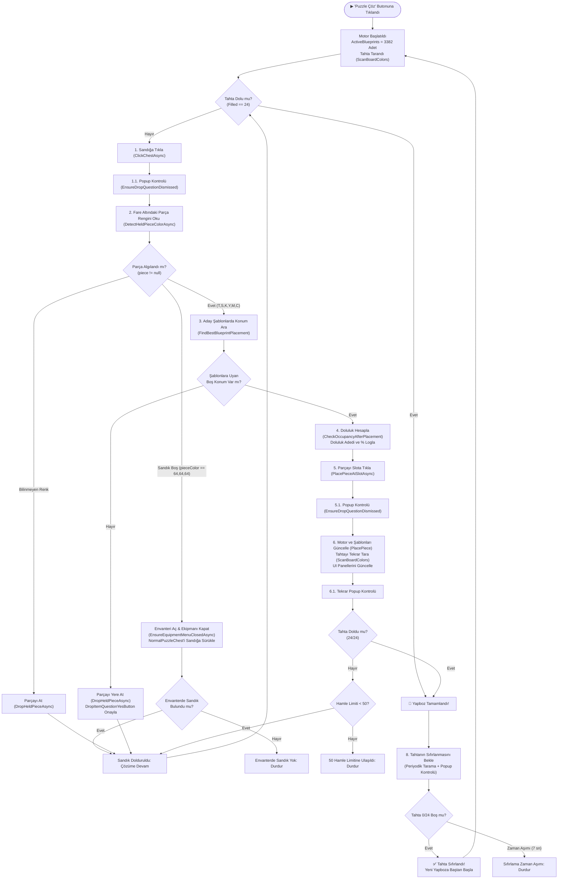

# 🧩 Balık Yapboz (Fish Puzzle) Çözüm Algoritması ve Çalışma Prensipleri

Bu doküman, Aether projesi içerisindeki **Balık Yapboz (Fish Puzzle)** mini oyununu otomatik çözen algoritmanın mimarisini, veri modellerini, karar mekanizmalarını ve Mermaid akış şemalarını detaylandırmaktadır.

---

## 📌 1. Temel Oyun Kuralları ve Veri Temsili

### 1.1. Tahta Mimarisi (24-Bit Bitboard)
- **Izgara Boyutu:** 4 Satır × 6 Sütun = **24 Slot**
- **Slot İndeksleme:** Satır-öncelikli (Row-Major), `Index = (Row × 6) + Col` (0..23)
- **Bitboard Temsili:** Tahtanın anlık doluluk durumu tek bir `ulong` (24-bit maske) ile tutulur.
  - `0x000000` = Tamamen Boş
  - `0xFFFFFF` (16.777.215) = Tamamen Dolu (24/24)

### 1.2. Parça Geometrisi ve Tanımları
Parçalar sabittir, **döndürülemez** (No Rotation).

| Kod | Parça Adı | Blok Sayısı | Geometri (Ofsetler) | Renk |
| :---: | :--- | :---: | :--- | :--- |
| **T** | Turuncu (1x1) | 1 | `(0,0)` | Turuncu |
| **S** | Sarı (Ters L) | 3 | `(0,0), (0,1), (1,1)` | Sarı |
| **K** | Kırmızı (Z) | 4 | `(0,0), (0,1), (1,1), (1,2)` | Kırmızı |
| **Y** | Yeşil (L) | 3 | `(0,0), (1,0), (1,1)` | Yeşil |
| **M** | Mavi (Dikey 3x1) | 3 | `(0,0), (1,0), (2,0)` | Mavi |
| **C** | Camgöbeği (2x2) | 4 | `(0,0), (0,1), (1,0), (1,1)` | Camgöbeği |

---

## 🧠 2. Çözüm Algoritması: PredefinedBlueprints Tabanlı Aday Eleme

Rastgele yerleştirme veya kör heuristik yöntemler yerine, sistem **3.382 adet matematiksel olarak kanıtlanmış tam çözüm şablonunu (`PredefinedBlueprints`)** kullanır.

### 2.1. Aday Şablon Listesi (`_activeBlueprints`)
- **Başlangıç Durumu:** Tahta boşken (0/24) 3.382 şablonun tamamı aktiftir.
- **Dinamik Daraltma:** Tahtaya bir parça yerleştirildiğinde, aktif şablon listesi yalnızca o parçayı o koordinatta içeren şablonlara daraltılır:
  $$\text{ActiveBlueprints}_{t+1} = \{ B \in \text{ActiveBlueprints}_t \mid \exists P \in B : P.\text{Type} = \text{Type} \land P.\text{Pos} = \text{Pos} \}$$

### 2.2. Yerleşim Pozisyonu Seçim Kriterleri (Ranking)
Sandıktan çekilen parça için aktif şablonlarda birden fazla boş yerleşim koordinatı varsa, pozisyonlar şu öncelik sırasına göre puanlanır:
1. **Maksimum Şablon Koruma (`MatchCount DESC`):** En fazla sayıda alternatif çözüm yolunu hayatta tutan pozisyon tercih edilir.
2. **Minimum Toplam Parça (`MinTotalPieces ASC`):** Yapbozu en az hamlede (en az parça çekerek) bitirmeyi vadeden şablonlar önceliklendirilir.
3. **Heuristik Eşitlik Bozucu (`HeuristicScore DESC`):** Duvar teması, alt satır tercihi ve köşe bonusu gibi geometrik avantajlar değerlendirilir.

---

## 📊 3. Algoritma Akış Şeması (Flowchart)

---

## ⚙️ 4. Kritik İşlem Adımlarının Detayları

### 4.1. Parça Alma ve Renk Tespiti
1. `PuzzleGameChestArea` bölgesinin merkezine sol tıklanır.
2. Fare `PuzzleGameSlotArea`'nın 10 piksel altına getirilir.
3. Fare imlecinin altındaki 10×10 piksellik örnekleme alanından renk taranır (`Colors.AllPuzzleColors` ile Euclidean mesafe eşleştirmesi).

### 4.2. Uygunsuz Parçanın Yere Atılması (`DropHeldPieceAsync`)
- Eğer çekilen parça mevcut aktif şablonların hiçbirine uymuyorsa:
  1. `PuzzleGameSlotArea` içerisine sağ tıklanır.
  2. Fare anında slot alanı dışına (`MoveCursorOutsideSlotArea`) çekilir.
  3. `DropItemQuestionArea` taranarak `DropItemQuestionYesButton` veya `OkButton` şablonlarından biri bulunana kadar beklenir ve tıklanır.
  4. Fare tekrar dışarı çekilir ve butonun tamamen kapandığı **double-check** ile teyit edilir (kapanmamışsa tekrar tıklanır).
  5. **Onay Butonuna Tıklanmadan İlerlenmez:** Popup butonlarından birine başarıyla tıklanıp pencere kapanmadan sonraki renk tarama, parça seçme veya yerleştirme adımlarına kesinlikle geçilmez.
  6. Parça atma sayacı artırılır ve sandıktan yeni parça çekilir.

### 4.3. Parça Yerleştirme ve Popup Güvenliği
- Hedef slotun ekran koordinatları hesaplanır:
  $$\text{ClickX} = \text{StartX} + \left(\text{Col} \times \text{SlotWidth} + \frac{\text{SlotWidth}}{2}\right)$$
  $$\text{ClickY} = \text{StartY} + \left(\text{Row} \times \text{SlotHeight} + \frac{\text{SlotHeight}}{2}\right)$$
- Slota tıklandıktan hemen sonra fare `MoveCursorOutsideSlotArea` ile slot alanının dışına çekilir.
- Olası soru ve onay kutuları için `DismissConfirmationPopupAsync` çağrılır (`DropItemQuestionYesButton` ve `OkButton` taranır, tıklanır, fare dışarı alınır, double-check yapılır).
- Tahta taranır (`ScanBoardColors`), motor ve arayüz güncellenir.

### 4.4. Sandık Boşaldığında Envanterden Otomatik Sandık Doldurma (`TryRefillChestFromInventoryAsync`)
- Eğer sandıktan parça çekilemezse (renk tespit edilemezse / tahta `0x404040` boş rengi dönerse):
  1. `StartupEquipmentMenuFunction.EnsureEquipmentMenuClosedAsync` çalıştırılarak 'I' tuşu ile envanter açılır ve ekipman menüsü güvenli şekilde kapatılır.
  2. `RegionConstants.InventoryPosition` içerisinde `TemplateConstants.InventoryItems.NormalPuzzleChest` (`normalPuzzleChest.png`) şablonu taranır.
  3. Bulunan sandıklardan rastgele biri seçilerek `HumanMouseService.Instance.DragAndDropLocalAsync` ile `RegionConstants.PuzzleGameChestArea` merkezine sürüklenip bırakılır.
  4. Olası soru/onay kutuları kapatılır (`DismissConfirmationPopupAsync`).
  5. Sandık yerleştirildikten sonra yapboz çözme döngüsü kesintisiz olarak devam eder.
  6. Envanterde sandık bulunamazsa uyarı loglanarak çözüm durdurulur.

### 4.5. Yapboz Tamamlanması ve Kesintisiz Döngü (Auto-Restart)
- 24/24 doluluk sağlandığında:
  - Bot log paneline başarı mesajını yazar.
  - Tahtanın ödül verilip sıfırlanmasını beklemek üzere 300ms aralıklarla ekranı tarar.
  - Tahtadaki dolu slot sayısı `0` olduğu anda `engine.Reset()` çağrılır ve yeni yapboz çözümü otomatik olarak başlar.

### 4.6. F8 Acil Durdurma Kısayolu (Emergency Stop)
- Oyun içinde veya arka planda `F8` tuşuna basıldığında:
  - Global `HOTKEY_PUZZLE_STOP_F8` (VK_F8) tetiklenir.
  - `FishPuzzlePage.CancelSolving()` ile `CancellationTokenSource` anında iptal edilir.
  - Yapboz çözme döngüsü temiz bir şekilde sonlanır ve arayüz butonları yeniden aktif hale gelir.
